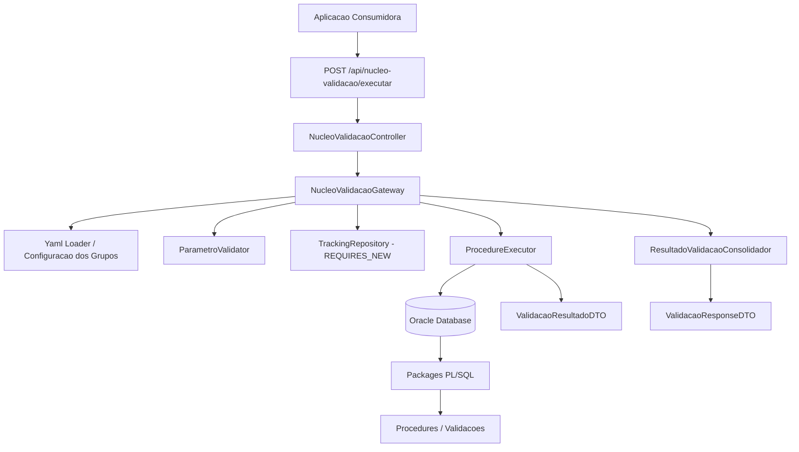

# nucleo-validacao

> Gateway generico para execucao de grupos de validacoes bancarias via PL/SQL. A aplicacao Java atua como biblioteca que descobre, valida e executa procedures Oracle associadas a contextos de negocio bancario, consolidando resultados e registrando auditoria independente.

## Stack & Arquitetura

| Camada        | Tecnologia                          |
|---------------|--------------------------------------|
| Runtime       | Java 17+                             |
| Framework     | Spring Boot 3.x                      |
| JDBC          | Spring JDBC + Oracle JDBC (CallableStatement) |
| Banco de dados| Oracle Database Free 23c            |
| Auditoria     | @Transactional(REQUIRES_NEW)         |
| Configuracao  | YAML + SnakeYAML                    |
| Container     | Docker Compose                      |
| Testes        | JUnit 5 + AssertJ + Testcontainers  |

> Padrao arquitetural: **Gateway/Mediator** com configuracao declarativa em YAML, auditoria transacional independente e execucao via JDBC puro.

## Estrutura de Pastas

```
src/main/java/com/empresa/nucleovalidacao/
├── config/
│   ├── BancoMetadataDiscovery.java
│   ├── NucleoValidacaoYamlLoader.java
│   └── SchedulingConfig.java
├── controller/
│   ├── NucleoValidacaoController.java
│   └── ComplianceController.java
├── model/
│   ├── dto/           (records de request/response/config)
│   ├── estado/        (enums: EstadoValidacao, EstadoExecucao, ResultadoNegocio, etc.)
│   └── metadata/      (ProcedureSignature, ProcedureParameter, ParameterMode)
├── repository/
│   ├── ValidacaoTrackingRepository.java
│   └── ComplianceRepository.java
├── service/
│   ├── NucleoValidacaoGateway.java
│   ├── ProcedureExecutor.java
│   ├── ParametroValidator.java
│   ├── ResultadoGrupoConsolidador.java
│   ├── SqlErrorMapper.java
│   └── ComplianceAlertService.java
├── exception/
│   ├── GrupoNaoEncontradoException.java
│   ├── ValidacaoException.java
│   ├── ProcedureExecutionException.java
│   └── GlobalExceptionHandler.java
└── util/
    ├── ParametrosMapper.java
    └── JsonUtils.java

database/init/
├── 01-create-users.sql
├── 02-create-tables.sql
├── 03-create-packages.sql
├── 04-create-grants.sql
└── 05-insert-mock-data.sql
```

## Conceito Central

A aplicacao consumidora envia `idGrupoValidacao` + lista de parametros. O gateway:

1. Busca configuracao do grupo no YAML
2. Valida parametros obrigatorios, tipos e regras (min/max/regex)
3. Descobre as validacoes do grupo
4. Para cada validacao, faz binding dos parametros e executa a procedure PL/SQL via `CallableStatement`
5. Registra auditoria transacional com `REQUIRES_NEW` (sobrevive a rollback)
6. Consolida resultado tecnico + resultado de negocio
7. Retorna JSON padronizado

Java nao contem regra bancaria principal. Toda regra de negocio esta simulada em PL/SQL.

## Como Rodar Localmente

### Pre-requisitos

- Docker + Docker Compose
- Java 17+
- Maven 3.8+
- Acesso ao registry da Oracle (`container-registry.oracle.com`)

### Setup

```bash
# 1. Clone o repositorio
git clone <url> && cd grupo-validacao

# 2. Suba o Oracle Database Free
docker compose up -d
# Aguarde ~2-3 minutos para o banco iniciar e os scripts SQL serem executados

# 3. Compile e rode a aplicacao
mvn clean spring-boot:run
```

A API estara disponivel em `http://localhost:8080`.

### Oracle Database

O `docker-compose.yml` sobe Oracle Database Free 23c na porta `1521`:
- **SID:** FREEPDB1
- **Usuario aplicacao:** APP_VALIDACAO / app123
- **Usuario dono das packages:** BANK_CORE / bank123

Os scripts SQL em `database/init/` sao executados automaticamente na inicializacao e criam:
- Usuarios (BANK_CORE, APP_VALIDACAO, APP_READONLY, APP_READWRITE, APP_RESTRICTED)
- Tabelas de negocio (CLIENTES, CONTAS, CONTRATOS, CHAVES_PIX, PROPOSTAS_CREDITO, OPERACOES_PIX, BOLETOS)
- Tabelas de auditoria (RASTRO_VALIDACAO, RASTRO_EXECUCAO)
- Packages PL/SQL (PK_SCORE, PK_BACEN, PK_RENDA, PK_CREDITO, PK_PROPOSTA, PK_ONBOARDING, PK_PIX, PK_BOLETOS, PK_CARTAO, PK_COMPLIANCE, PK_RECUPERACAO, PK_INVESTIMENTOS, PK_GARANTIAS, PK_FECHAMENTO)
- Grants para cada usuario
- Dados mockados

## Endpoints

### POST /api/nucleo-validacao/executar

Executa um grupo de validacoes.

**Request (200 - ANALISE_CREDITO_PESSOAL):**

```json
{
  "idGrupoValidacao": 200,
  "correlationId": "6e0a23e0-5b9a-43e1-bc44-b1ad7dfe11d22",
  "parametros": [
    { "nome": "cod_cli", "valor": 1 },
    { "nome": "valor_solicitado", "valor": 10000.00 },
    { "nome": "qtd_parcelas", "valor": 24 }
  ]
}
```

**Response (200 - Sucesso):**

```json
{
  "idGrupoSolicitacao": 90001,
  "idGrupoValidacao": 200,
  "nomeGrupoValidacao": "ANALISE_CREDITO_PESSOAL",
  "estadoGrupo": "FINALIZADO_SUCESSO",
  "resultadoNegocioGrupo": "APROVADO",
  "mensagemGrupoValidacao": "Grupo de validacoes executado com sucesso",
  "correlationId": "6e0a23e0-5b9a-43e1-bc44-b1ad7dfe11d22",
  "validacoes": [
    {
      "idValidacao": 201,
      "nomeValidacao": "calcular_score_interno",
      "procedureRef": "PK_SCORE.CALCULAR_SCORE_INTERNO",
      "tipo": "LEITURA",
      "estadoTecnico": "SUCESSO",
      "resultadoNegocio": "APROVADO",
      "tempoMs": 37,
      "mensagens": ["Score interno aprovado"],
      "payload": { "score": 850, "scoreMinimo": 600 }
    }
  ]
}
```

**Response (400 - Falha de validacao):**

```json
{
  "idGrupoValidacao": 200,
  "nomeGrupoValidacao": "ANALISE_CREDITO_PESSOAL",
  "estadoGrupo": "FALHA_VALIDACAO",
  "mensagem": "Parametros de entrada invalidos",
  "correlationId": "abc-123",
  "erros": [
    {
      "campo": "valor_solicitado",
      "mensagem": "Parametro obrigatorio nao informado",
      "valorRecebido": null
    }
  ]
}
```

### GET /admin/compliance/alertas

Retorna alertas de seguranca (falhas de autorizacao > 20% nos ultimos 7 dias).

## Exemplos de curl

### Grupo 200 - Sucesso

```bash
curl -X POST http://localhost:8080/api/nucleo-validacao/executar \
  -H "Content-Type: application/json" \
  -d '{
    "idGrupoValidacao": 200,
    "correlationId": "test-200",
    "parametros": [
      {"nome": "cod_cli", "valor": 1},
      {"nome": "valor_solicitado", "valor": 10000.00},
      {"nome": "qtd_parcelas", "valor": 24}
    ]
  }'
```

### Grupo 100 - Abertura de Conta

```bash
curl -X POST http://localhost:8080/api/nucleo-validacao/executar \
  -H "Content-Type: application/json" \
  -d '{
    "idGrupoValidacao": 100,
    "correlationId": "test-100",
    "parametros": [
      {"nome": "cpf_cnpj", "valor": "11111111111"},
      {"nome": "canal_origem", "valor": "APP"},
      {"nome": "biometria_hash", "valor": "hash1234567890abc"}
    ]
  }'
```

### Grupo 300 - PIX

```bash
curl -X POST http://localhost:8080/api/nucleo-validacao/executar \
  -H "Content-Type: application/json" \
  -d '{
    "idGrupoValidacao": 300,
    "correlationId": "test-300",
    "parametros": [
      {"nome": "agencia", "valor": "0001"},
      {"nome": "conta", "valor": "10000-0"},
      {"nome": "chave_destino", "valor": "22222222222"},
      {"nome": "valor", "valor": 100.00},
      {"nome": "id_solicitacao", "valor": "PIX-TEST-001"}
    ]
  }'
```

## Como simular falha de autorizacao

Execute a aplicacao com o profile `restricted`:

```bash
mvn spring-boot:run -Dspring-boot.run.profiles=restricted
```

O usuario `APP_RESTRICTED` nao tem grants, entao qualquer execucao de proceduredispara `ORA-01031`.

## Como consultar rastros

Conecte-se ao banco e consulte as tabelas de auditoria:

```sql
SELECT * FROM RASTRO_VALIDACAO ORDER BY DATA_INICIO DESC;
SELECT * FROM RASTRO_EXECUCAO ORDER BY DATA_EXECUCAO DESC;
```

## Testes

```bash
# Todos os testes (requer Oracle rodando)
mvn test

# Apenas testes unitarios (validacao)
mvn test -Dtest=ParametroValidatorTest
```

## Diagrama de Arquitetura



## Comportamento Esperado

1. Java nao contem a regra principal de negocio
2. A regra principal esta simulada em PL/SQL
3. Java atua como gateway generico
4. O consumidor nao sabe quais procedures serao chamadas
5. O consumidor envia apenas idGrupoValidacao + parametros
6. A configuracao define quais validacoes pertencem ao grupo
7. Cada validacao mapeia parametros logicos para parametros reais da procedure
8. A auditoria e independente da transacao de negocio
9. Falhas tecnicas nao sao confundidas com reproducao de negocio
10. O retorno final e consolidado

## Grupos Implementados

| ID  | Nome                          | Contexto                     |
|-----|-------------------------------|------------------------------|
| 100 | ABERTURA_CONTA_CORRENTE      | Onboarding digital PF/PJ    |
| 200 | ANALISE_CREDITO_PESSOAL      | Emprestimo pessoal          |
| 300 | OPERACOES_PIX                | Transferencias instantaneas |
| 400 | COBRANCA_BOLETOS             | Emissao e gestao de titulos |
| 500 | GESTAO_CARTAO_CREDITO        | Emissao, limite e ativacao  |
| 600 | COMPLIANCE_KYC_AML           | Prevencao a lavagem         |
| 700 | RECUPERACAO_CREDITO          | Inadimplencia e renegociacao |
| 800 | INVESTIMENTOS_RENDA_FIXA     | CDB, LCI, LCA, Tesouro      |
| 900 | FINANCIAMENTO_GARANTIA_REAL  | Imobiliario, veicular       |
| 1000| CONCILIACAO_FECHAMENTO       | Operacional/contabil diario |
