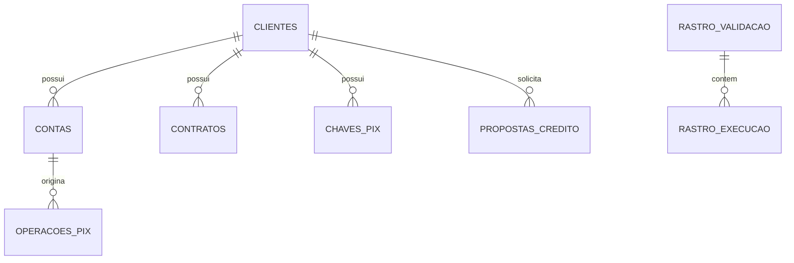

# Data Model — nucleo-validacao

> Documento vivo do modelo de dados. Atualizado sempre que uma entidade for criada, alterada ou removida.
> **Ultima atualizacao:** 2026-06-03

---

## Indice

- [Visao Geral](#visao-geral)
- [Diagrama ER](#diagrama-er)
- [Entidades de Negocio](#entidades-de-negocio)
- [Entidades de Auditoria](#entidades-de-auditoria)
- [Enums e Dominio de Valores](#enums-e-dominio-de-valores)

---

## Visao Geral

Modelo de dados composto por 7 tabelas de negocio (simulando ambiente bancario) e 2 tabelas de auditoria transacional. Banco relacional Oracle com acesso via JDBC puro (sem JPA).

**Banco de dados:** Oracle Database Free 23c
**Acesso:** JDBC via Spring JdbcTemplate e CallableStatement
**Schema:** `BANK_CORE` (dono das tabelas e packages)

---

## Diagrama ER

---

## Entidades de Negocio

---

### CLIENTES

> Cadastro de clientes da instituicao financeira.

**Tabela:** `CLIENTES`
**Schema:** `BANK_CORE`

| Campo | Tipo SQL | Nullable | Default | Descricao |
|-------|----------|----------|---------|-----------|
| `COD_CLI` | NUMBER | Nao | — | ID interno do cliente (PK) |
| `CPF_CNPJ` | VARCHAR2(20) | Nao | — | Documento do cliente |
| `NOME` | VARCHAR2(150) | Nao | — | Nome completo |
| `SCORE_INTERNO` | NUMBER | Sim | NULL | Score de credito interno |
| `STATUS_CADASTRAL` | VARCHAR2(30) | Sim | NULL | Ativo, Pendente, Bloqueado |
| `RENDA_COMPROVADA` | NUMBER(15,2) | Sim | NULL | Renda comprovada |
| `PERFIL_INVESTIDOR` | VARCHAR2(30) | Sim | NULL | Conservador, Moderado, Agressivo |
| `DATA_CADASTRO` | DATE | Sim | SYSDATE | Data de cadastro |

**Constraints:**
- `PRIMARY KEY (COD_CLI)`

**Relacionamentos:**
- Um `CLIENTE` tem muitas `CONTAS` via `CONTAS.COD_CLI`
- Um `CLIENTE` tem muitos `CONTRATOS` via `CONTRATOS.COD_CLI`
- Um `CLIENTE` tem muitas `CHAVES_PIX` via `CHAVES_PIX.COD_CLI`

---

### CONTAS

> Contas correntes dos clientes.

**Tabela:** `CONTAS`
**Schema:** `BANK_CORE`

| Campo | Tipo SQL | Nullable | Default | Descricao |
|-------|----------|----------|---------|-----------|
| `AGENCIA` | VARCHAR2(10) | Nao | — | Agencia (parte da PK) |
| `CONTA` | VARCHAR2(20) | Nao | — | Numero da conta (parte da PK) |
| `COD_CLI` | NUMBER | Nao | — | ID do cliente (FK) |
| `SALDO_DISPONIVEL` | NUMBER(15,2) | Sim | NULL | Saldo disponivel |
| `STATUS` | VARCHAR2(30) | Sim | NULL | Ativa, Bloqueada, Pendente |
| `LIMITE_PIX_DIARIO` | NUMBER(15,2) | Sim | NULL | Limite PIX diario |

**Constraints:**
- `PRIMARY KEY (AGENCIA, CONTA)`

**Relacionamentos:**
- Muitas `CONTAS` pertencem a um `CLIENTE` via `COD_CLI`
- Uma `CONTA` origina muitas `OPERACOES_PIX` via `AGENCIA_ORIGEM, CONTA_ORIGEM`

---

### CONTRATOS

> Contratos de emprestimo e financiamento.

**Tabela:** `CONTRATOS`
**Schema:** `BANK_CORE`

| Campo | Tipo SQL | Nullable | Default | Descricao |
|-------|----------|----------|---------|-----------|
| `CONTRATO_ID` | NUMBER | Nao | — | ID do contrato (PK) |
| `COD_CLI` | NUMBER | Nao | — | ID do cliente (FK) |
| `TIPO_OPERACAO` | VARCHAR2(50) | Sim | NULL | Tipo da operacao |
| `STATUS` | VARCHAR2(30) | Sim | NULL | Ativo, Vencido, Inadimplente |
| `VALOR_TOTAL` | NUMBER(15,2) | Sim | NULL | Valor total do contrato |
| `QTD_PARCELAS` | NUMBER | Sim | NULL | Quantidade de parcelas |
| `DIAS_ATRASO` | NUMBER | Sim | NULL | Dias em atraso |

---

### CHAVES_PIX

> Chaves PIX cadastradas.

**Tabela:** `CHAVES_PIX`
**Schema:** `BANK_CORE`

| Campo | Tipo SQL | Nullable | Default | Descricao |
|-------|----------|----------|---------|-----------|
| `CHAVE` | VARCHAR2(150) | Nao | — | Chave PIX (PK) |
| `TIPO` | VARCHAR2(30) | Sim | NULL | CPF, CNPJ, Email, Celular |
| `COD_CLI` | NUMBER | Nao | — | ID do cliente (FK) |
| `STATUS` | VARCHAR2(30) | Sim | NULL | Ativa, Inativa |

---

### PROPOSTAS_CREDITO

> Propostas de credito geradas.

**Tabela:** `PROPOSTAS_CREDITO`
**Schema:** `BANK_CORE`

| Campo | Tipo SQL | Nullable | Default | Descricao |
|-------|----------|----------|---------|-----------|
| `PROPOSTA_ID` | NUMBER | Nao | IDENTITY | ID da proposta (PK) |
| `COD_CLI` | NUMBER | Nao | — | ID do cliente |
| `VALOR_SOLICITADO` | NUMBER(15,2) | Sim | NULL | Valor solicitado |
| `QTD_PARCELAS` | NUMBER | Sim | NULL | Quantidade de parcelas |
| `TAXA_MENSAL` | NUMBER(10,4) | Sim | NULL | Taxa mensal de juros |
| `CET` | NUMBER(10,4) | Sim | NULL | Custo Efetivo Total |
| `STATUS` | VARCHAR2(30) | Sim | NULL | Pendente, Aprovada |
| `DATA_CRIACAO` | TIMESTAMP | Sim | SYSTIMESTAMP | Data de criacao |

---

### OPERACOES_PIX

> Operacoes PIX realizadas.

**Tabela:** `OPERACOES_PIX`
**Schema:** `BANK_CORE`

| Campo | Tipo SQL | Nullable | Default | Descricao |
|-------|----------|----------|---------|-----------|
| `ID_OPERACAO` | VARCHAR2(100) | Nao | — | ID da operacao (PK) |
| `AGENCIA_ORIGEM` | VARCHAR2(10) | Sim | NULL | Agencia de origem |
| `CONTA_ORIGEM` | VARCHAR2(20) | Sim | NULL | Conta de origem |
| `CHAVE_DESTINO` | VARCHAR2(150) | Sim | NULL | Chave PIX de destino |
| `VALOR` | NUMBER(15,2) | Sim | NULL | Valor da transferencia |
| `STATUS` | VARCHAR2(30) | Sim | NULL | Pendente, Executado |
| `DATA_CRIACAO` | TIMESTAMP | Sim | SYSTIMESTAMP | Data de criacao |

---

### BOLETOS

> Boletos registrados.

**Tabela:** `BOLETOS`
**Schema:** `BANK_CORE`

| Campo | Tipo SQL | Nullable | Default | Descricao |
|-------|----------|----------|---------|-----------|
| `NOSSO_NUMERO` | VARCHAR2(50) | Nao | — | Nosso numero (PK) |
| `CPF_CNPJ_PAGADOR` | VARCHAR2(20) | Sim | NULL | CPF/CNPJ do pagador |
| `VALOR` | NUMBER(15,2) | Sim | NULL | Valor do boleto |
| `DATA_VENCIMENTO` | DATE | Sim | NULL | Data de vencimento |
| `STATUS` | VARCHAR2(30) | Sim | NULL | Pendente, Vencido, Baixado |

---

## Entidades de Auditoria

---

### RASTRO_VALIDACAO

> Auditoria da execucao de cada grupo de validacoes.

**Tabela:** `RASTRO_VALIDACAO`
**Schema:** `BANK_CORE`

| Campo | Tipo SQL | Nullable | Default | Descricao |
|-------|----------|----------|---------|-----------|
| `ID_GRUPO_SOLICITACAO` | NUMBER | Nao | IDENTITY | ID da solicitacao (PK) |
| `ID_GRUPO_DEFINICAO` | NUMBER | Nao | — | ID do grupo no YAML |
| `NOME_GRUPO` | VARCHAR2(150) | Nao | — | Nome do grupo |
| `ESTADO` | VARCHAR2(40) | Nao | — | Estado do grupo (CRIADO, EXECUTANDO, etc.) |
| `PARAMETROS_ENTRADA` | CLOB | Sim | NULL | JSON dos parametros de entrada |
| `DATA_INICIO` | TIMESTAMP | Sim | SYSTIMESTAMP | Inicio da execucao |
| `DATA_FIM` | TIMESTAMP | Sim | NULL | Fim da execucao |
| `RESULTADO_FINAL_JSON` | CLOB | Sim | NULL | JSON consolidado dos resultados |
| `USUARIO_DB` | VARCHAR2(100) | Sim | NULL | Usuario do banco |
| `CORRELATION_ID` | VARCHAR2(100) | Sim | NULL | ID de correlacao |

**Indices:**
- `IDX_RASTRO_VALIDACAO_ESTADO` em `ESTADO`
- `IDX_RASTRO_VALIDACAO_DATA` em `DATA_INICIO`

**Relacionamentos:**
- Um `RASTRO_VALIDACAO` contem muitos `RASTRO_EXECUCAO` via `RASTRO_EXECUCAO.ID_GRUPO_SOLICITACAO`

---

### RASTRO_EXECUCAO

> Auditoria da execucao de cada validacao individual.

**Tabela:** `RASTRO_EXECUCAO`
**Schema:** `BANK_CORE`

| Campo | Tipo SQL | Nullable | Default | Descricao |
|-------|----------|----------|---------|-----------|
| `ID_LOG` | NUMBER | Nao | IDENTITY | ID do log (PK) |
| `ID_GRUPO_SOLICITACAO` | NUMBER | Nao | — | FK para RASTRO_VALIDACAO |
| `ID_CONSISTENCIA_DEF` | NUMBER | Nao | — | ID da validacao no YAML |
| `NOME_CONSISTENCIA` | VARCHAR2(150) | Nao | — | Nome da validacao |
| `PROCEDURE_REF` | VARCHAR2(200) | Nao | — | Referencia da procedure |
| `ESTADO_TECNICO` | VARCHAR2(40) | Nao | — | Estado tecnico (SUCESSO, FALHA_EXECUCAO, etc.) |
| `RESULTADO_NEGOCIO` | VARCHAR2(40) | Sim | NULL | Resultado de negocio |
| `TEMPO_MS` | NUMBER | Sim | NULL | Tempo de execucao em ms |
| `PAYLOAD_RETORNO` | CLOB | Sim | NULL | JSON de retorno da procedure |
| `SQL_STATE` | VARCHAR2(20) | Sim | NULL | SQLState do erro |
| `SQL_ERROR_CODE` | NUMBER | Sim | NULL | ErrorCode do erro |
| `MENSAGEM_ERRO` | VARCHAR2(4000) | Sim | NULL | Mensagem de erro |
| `USUARIO_DB` | VARCHAR2(100) | Sim | NULL | Usuario do banco |
| `DATA_EXECUCAO` | TIMESTAMP | Sim | SYSTIMESTAMP | Data da execucao |

**Constraints:**
- `FOREIGN KEY (ID_GRUPO_SOLICITACAO) REFERENCES RASTRO_VALIDACAO(ID_GRUPO_SOLICITACAO) ON DELETE CASCADE`

**Indices:**
- `IDX_RASTRO_EXECUCAO_GRUPO` em `ID_GRUPO_SOLICITACAO`
- `IDX_RASTRO_EXECUCAO_ESTADO` em `ESTADO_TECNICO`

---

## Enums e Dominio de Valores

### EstadoGrupo

Usado em: `RASTRO_VALIDACAO.ESTADO`, `GrupoConsistenciaResponseDTO.estadoGrupo`

| Valor | Significado |
|-------|-------------|
| `CRIADO` | Grupo registrado, inicio da execucao |
| `VALIDANDO` | Parametros sendo validados |
| `EXECUTANDO` | Consistencias em execucao |
| `FINALIZADO_SUCESSO` | Todas as validacoes executadas |
| `FINALIZADO_PARCIAL` | Algumas validacoes falharam tecnicamente |
| `FALHA_VALIDACAO` | Parametros de entrada invalidos |
| `FALHA_CRITICA` | Erro interno da aplicacao |
| `FALHA_AUTORIZACAO` | Erro de permissao no banco |
| `CANCELADO` | Grupo cancelado |

### EstadoConsistencia

Usado em: `RASTRO_EXECUCAO.ESTADO_TECNICO`, `ConsistenciaResultadoDTO.estadoTecnico`

| Valor | Significado |
|-------|-------------|
| `AGUARDANDO` | Aguardando execucao (grupo abortado) |
| `EXECUTANDO` | Em execucao |
| `SUCESSO` | Executada com sucesso |
| `FALHA_VALIDACAO` | Erro de validacao |
| `FALHA_EXECUCAO` | Erro na execucao da procedure |
| `FALHA_AUTORIZACAO` | Erro de permissao (ORA-01031) |
| `TIMEOUT` | Timeout na execucao |

### ResultadoNegocio

Usado em: `RASTRO_EXECUCAO.RESULTADO_NEGOCIO`, `ConsistenciaResultadoDTO.resultadoNegocio`, `GrupoConsistenciaResponseDTO.resultadoNegocioGrupo`

| Valor | Significado |
|-------|-------------|
| `APROVADO` | Regra de negocio aprovada |
| `REPROVADO` | Regra de negocio reprovada |
| `ALERTA` | Alerta gerado pela regra |
| `INCONCLUSIVO` | Resultado inconclusivo (falha tecnica) |

### TipoConsistencia

Usado em: `ConsistenciaDefinicaoDTO.tipo`, `ConsistenciaResultadoDTO.tipo`

| Valor | Significado |
|-------|-------------|
| `LEITURA` | Operacao de leitura (SELECT) |
| `ESCRITA` | Operacao de escrita (INSERT/UPDATE) |

### TipoParametro

Usado em: `ParametroDefinicaoDTO.tipo`

| Valor | Significado |
|-------|-------------|
| `STRING` | Texto |
| `INTEGER` | Numero inteiro |
| `LONG` | Numero longo |
| `BIGDECIMAL` | Numero decimal |
| `LOCALDATE` | Data (yyyy-MM-dd) |
| `BOOLEAN` | Booleano |
