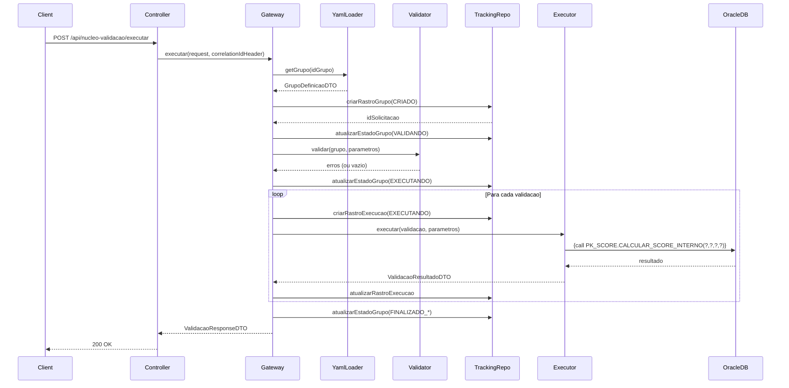

# System Feature Flows

> Registro historico e incremental dos fluxos internos de cada funcionalidade.
> Este documento cresce a cada nova feature implementada e nunca tem secoes removidas.

---

## Indice

- [Visao Geral da Arquitetura](#visao-geral-da-arquitetura)
- [Convencoes deste Documento](#convencoes-deste-documento)
- [Feature: Execucao de Grupo de Validacoes](#feature-execucao-de-grupo-de-validacoes)
- [Feature: Auditoria Transacional Independente](#feature-auditoria-transacional-independente)
- [Feature: Monitoramento de Compliance](#feature-monitoramento-de-compliance)

---

## Visao Geral da Arquitetura

**Padrao arquitetural:** Gateway/Mediator com configuracao declarativa em YAML.

**Fluxo global de uma requisicao:**

```
HTTP Request
    └── Controller (recebe request generico)
            └── Gateway (orquestrador)
                    ├── YamlLoader (configuracao do grupo)
                    ├── ParametroValidator (validacao de entrada)
                    ├── ValidacaoTrackingRepository (auditoria REQUIRES_NEW)
                    ├── ProcedureExecutor (CallableStatement)
                    │         └── Oracle Database (Packages PL/SQL)
                    └── ResultadoValidacaoConsolidador (consolidacao final)
```

**Camadas e responsabilidades:**

| Camada         | Responsabilidade                                                  |
|----------------|-------------------------------------------------------------------|
| `controller`   | Receber requisicoes, delegar ao gateway, formatar resposta        |
| `service`      | Orquestrar fluxo de execucao, validar parametros, executar procedures |
| `repository`   | Persistencia de auditoria em tabelas Oracle                       |
| `config`       | Carga de configuracao YAML, descoberta de metadata do banco       |
| `model`        | DTOs, enums, records de metadata                                  |

---

## Convencoes deste Documento

- **Parametros de entrada** sao sempre genericos (`List<ParametroEntradaDTO>`)
- **Binding** entre parametros logicos e parametros da procedure e feito via YAML
- **Procedures PL/SQL** seguem convencao: parametros IN + P_RESULTADO_NEGOCIO OUT + P_MENSAGEM OUT + P_PAYLOAD_JSON OUT
- **Auditoria** usa `@Transactional(propagation = Propagation.REQUIRES_NEW)`
- **Erros SQL** sao mapeados por tipo (FALHA_AUTORIZACAO, TIMEOUT, FALHA_EXECUCAO)

---

# Feature: Execucao de Grupo de Validacoes

> **Versao:** 1.0.0
> **Implementada em:** 2026-06-03
> **Status:** Concluida

---

## Resumo

Gateway generico que recebe `idGrupoValidacao` + lista de parametros, descobre a configuracao do grupo no YAML, valida os parametros, executa cada validacao (procedure PL/SQL) com binding automatico, consolida os resultados e retorna JSON padronizado.

**Motivacao:** Simular arquitetura bancaria real onde Java atua apenas como orquestrador e a regra de negocio fica em PL/SQL.
**Resultado:** Aplicacao consumidora envia apenas o ID do grupo e parametros; nao precisa conhecer as procedures internas.

---

## Fluxo Principal

### 1. Ponto de Entrada

- **Tipo:** HTTP REST
- **Arquivo:** `NucleoValidacaoController.java`
- **Rota:** `POST /api/nucleo-validacao/executar`
- **Autenticacao:** Nao implementada (projeto de estudo)

A requisicao chega com `idGrupoValidacao` e `parametros` (lista generica). O `correlationId` e lido do header `X-Correlation-Id`; se ausente, um UUID e gerado automaticamente.

---

### 2. Validacao de Entrada

- **Arquivo:** `ParametroValidator.java`
- **Biblioteca:** Validacao manual de tipos e regras

| Campo | Tipo | Obrigatorio | Regra de validacao |
|-------|------|-------------|---------------------|
| idGrupoValidacao | Integer | Sim | Deve existir no YAML e estar ativo |
| X-Correlation-Id (header) | String | Nao | Se ausente, UUID e gerado |
| parametros | List (body) | Sim | Validacao conforme definicao do grupo |

A validacao do grupo inclui:

1. Verificar existencia do grupo no YAML
2. Verificar se grupo esta ativo
3. Para cada parametro definido no YAML:
   - Obrigatoriedade (se obrigatorio e ausente, erro)
   - Tipo (STRING, INTEGER, LONG, BIGDECIMAL, LOCALDATE, BOOLEAN)
   - Regras: min, max, regex, valoresPermitidos

**Falha de validacao:** HTTP 400 com `estadoGrupo = FALHA_VALIDACAO` e lista de `ErroValidacaoDTO`.

---

### 3. Orquestracao da Aplicacao

- **Arquivo:** `NucleoValidacaoGateway.java`

Fluxo completo:

1. Normalizar `correlationId` (gerar UUID se ausente)
2. Converter `List<ParametroEntradaDTO>` para `Map<String, Object>`
3. Buscar configuracao do grupo pelo `idGrupoValidacao` no YAML
4. Se grupo nao existir, retornar `FALHA_VALIDACAO`
5. Se grupo estiver inativo, retornar `FALHA_VALIDACAO`
6. Criar rastro do grupo com estado `CRIADO`
7. Atualizar grupo para `VALIDANDO`
8. Validar parametros obrigatorios, tipos, regras
9. Se houver erro de validacao, atualizar grupo para `FALHA_VALIDACAO` e retornar erro
10. Atualizar grupo para `EXECUTANDO`
11. Para cada validacao configurada:
    - Criar rastro da validacao com `EXECUTANDO`
    - Executar procedure via `ProcedureExecutor`
    - Se falhou e `abortar_grupo_em_falha=true`, interromper proximas
    - Atualizar rastro da validacao
12. Consolidar resultado do grupo via `ResultadoValidacaoConsolidador`
13. Atualizar rastro do grupo com estado final
14. Retornar `ValidacaoResponseDTO`

---

### 4. Regras de Negocio

| Regra | Descricao | Localizacao no Codigo |
|-------|-----------|----------------------|
| Toda regra de negocio esta em PL/SQL | Java nao contem regra bancaria | Packages PL/SQL no Oracle |
| Consolidacao do grupo | Define estado final e resultado de negocio | `ResultadoValidacaoConsolidador.java` |
| Auditoria REQUIRES_NEW | Auditoria sobrevive a rollback de negocio | `ValidacaoTrackingRepository.java` |
| Binding origem/destino | Mapeia parametro logico para parametro da procedure | `configuracoes-grupos.yaml` |
| Falha tecnica != reproducao negocio | Erro SQL separado de resultado de negocio | `SqlErrorMapper.java` |

---

### 5. Persistencia / Integracoes

**Repositorios utilizados:**

| Repository | Operacao | Arquivo |
|------------|----------|---------|
| ValidacaoTrackingRepository | INSERT/UPDATE RASTRO_VALIDACAO | `ValidacaoTrackingRepository.java` |
| ValidacaoTrackingRepository | INSERT/UPDATE RASTRO_EXECUCAO | `ValidacaoTrackingRepository.java` |
| ComplianceRepository | SELECT com agregacao | `ComplianceRepository.java` |

**Integracoes externas:**

| Servico | Operacao | Timeout | Retry |
|---------|----------|---------|-------|
| Oracle Database (CallableStatement) | Execucao de procedures | Por validacao (YAML) | Nao |

---

### 6. Resposta Final

**Sucesso — `200 OK`:**

```json
{
  "idGrupoSolicitacao": 90001,
  "idGrupoValidacao": 200,
  "nomeGrupoValidacao": "ANALISE_CREDITO_PESSOAL",
  "estadoGrupo": "FINALIZADO_SUCESSO",
  "resultadoNegocioGrupo": "APROVADO",
  "mensagemGrupoValidacao": "Grupo de validacoes executado com sucesso",
  "correlationId": "uuid",
  "validacoes": [
    {
      "idValidacao": 201,
      "nomeValidacao": "calcular_score_interno",
      "procedureRef": "PK_SCORE.CALCULAR_SCORE_INTERNO",
      "tipo": "LEITURA",
      "estadoTecnico": "SUCESSO",
      "resultadoNegocio": "APROVADO",
      "tempoMs": 37,
      "mensagens": ["Score interno aprovado"],
      "payload": { "score": 850, "scoreMinimo": 600 }
    }
  ]
}
```

**Erro de validacao — `400 Bad Request`:**

```json
{
  "idGrupoValidacao": 200,
  "nomeGrupoValidacao": "ANALISE_CREDITO_PESSOAL",
  "estadoGrupo": "FALHA_VALIDACAO",
  "mensagem": "Parametros de entrada invalidos",
  "correlationId": "uuid",
  "erros": [
    { "campo": "valor_solicitado", "mensagem": "Parametro obrigatorio nao informado", "valorRecebido": null }
  ]
}
```

---

## Fluxos Alternativos e Erros

| Cenario | HTTP Status | estadoGrupo | resultadoNegocioGrupo |
|---------|-------------|-------------|----------------------|
| Sucesso total | 200 | FINALIZADO_SUCESSO | APROVADO |
| Obrigatoria reprovou | 200 | FINALIZADO_SUCESSO | REPROVADO |
| Obrigatoria alerta | 200 | FINALIZADO_SUCESSO | ALERTA |
| Falha tecnica parcial | 200 | FINALIZADO_PARCIAL | INCONCLUSIVO |
| Falha de autorizacao | 200 | FALHA_AUTORIZACAO | INCONCLUSIVO |
| Parametro invalido | 400 | FALHA_VALIDACAO | N/A |
| Grupo inexistente | 400 | FALHA_VALIDACAO | N/A |
| Grupo inativo | 400 | FALHA_VALIDACAO | N/A |
| Erro interno | 500 | FALHA_CRITICA | INCONCLUSIVO |

---

## Diagrama de Sequencia



---

## Decisoes Tecnicas

### ADR-001 — Auditoria com REQUIRES_NEW

| Campo | Detalhe |
|-------|---------|
| **Status** | Aceita |
| **Data** | 2026-06-03 |
| **Contexto** | A auditoria precisa sobreviver mesmo se a transacao de negocio falhar com rollback |
| **Decisao** | Usar `@Transactional(propagation = Propagation.REQUIRES_NEW)` em todos os metodos de tracking |
| **Consequencias** | Cada escrita de auditoria abre transacao separada; levemente mais custoso, pero garante rastro mesmo em falhas |

### ADR-002 — Configuracao via YAML em vez de banco

| Campo | Detalhe |
|-------|---------|
| **Status** | Aceita |
| **Data** | 2026-06-03 |
| **Contexto** | Definir grupos, validacoes, bindings e regras de forma declarativa sem depender de banco |
| **Decisao** | Usar `configuracoes-grupos.yaml` carregado via SnakeYAML no startup |
| **Consequencias** | Alteracoes requerem restart; simplicidade e clareza na configuracao |

### ADR-003 — Contrato de entrada generico

| Campo | Detalhe |
|-------|---------|
| **Status** | Aceita |
| **Data** | 2026-06-03 |
| **Contexto** | Evitar DTO especifico por grupo; manter gateway agnostico ao dominio |
| **Decisao** | Usar `List<ParametroEntradaDTO>` com nome/valor, sem tipagem forte no contrato |
| **Consequencias** | Validacao de tipos feita em runtime; maior flexibilidade, menor seguranca de tipos em compile-time |

---

# Feature: Auditoria Transacional Independente

> **Versao:** 1.0.0
> **Implementada em:** 2026-06-03
> **Status:** Concluida

---

## Resumo

Registro de auditoria em duas tabelas (`RASTRO_VALIDACAO` e `RASTRO_EXECUCAO`) com transacao independente da execucao de negocio, garantindo que mesmo em caso de rollback nas procedures de escrita, o rastro permaneca persistido.

## Fluxo

1. Antes da execucao: INSERT em `RASTRO_VALIDACAO` com estado `CRIADO`
2. Durante validacao: UPDATE para `VALIDANDO`
3. Antes de cada validacao: INSERT em `RASTRO_EXECUCAO` com `EXECUTANDO`
4. Apos cada validacao: UPDATE com resultado tecnico, negocio, tempo, payload
5. Final: UPDATE do grupo com estado consolidado e JSON dos resultados

Todas as operacoes usam `@Transactional(propagation = Propagation.REQUIRES_NEW)`.

---

# Feature: Monitoramento de Compliance

> **Versao:** 1.0.0
> **Implementada em:** 2026-06-03
> **Status:** Concluida

---

## Resumo

Job agendado a cada 15 minutos que consulta as tabelas de rastro para detectar grupos com mais de 20% de falhas de autorizacao nos ultimos 7 dias. Resultados expostos via endpoint `GET /admin/compliance/alertas`.

## Fluxo

1. `ComplianceAlertService.verificarAnomalias()` executa a cada 900000ms (15 min)
2. Query agrega `RASTRO_VALIDACAO` + `RASTRO_EXECUCAO` por grupo
3. Calcula percentual de `FALHA_AUTORIZACAO`
4. Se > 20%, gera `AlertaSegurancaDTO`
5. Alertas disponiveis via `GET /admin/compliance/alertas`
